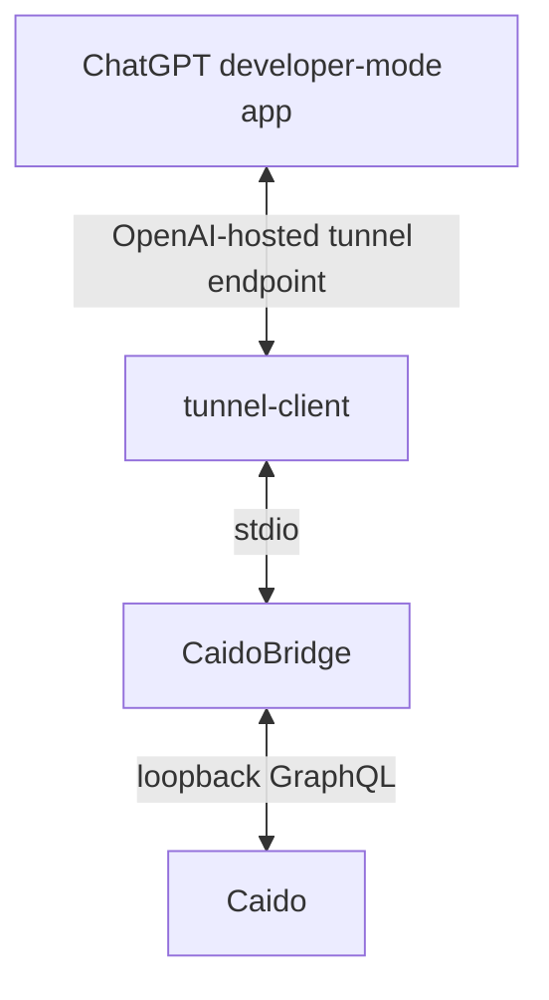

# CaidoBridge

[](https://github.com/ph-xyz/Caido-Bridge/actions/workflows/ci.yml)
[](https://go.dev/)
[](LICENSE)

CaidoBridge is a local Model Context Protocol (MCP) server that lets ChatGPT
inspect traffic captured by Caido and, after a separate opt-in, replay narrowly
defined HTTP requests through Caido.

> **Project status:** beta and local developer tool. Treat a build as a release
> candidate until its tagged source passes CI and the Windows acceptance
> checklist. Use only on systems you own or are explicitly authorized to test.

Product and executable name: **CaidoBridge / CaidoBridge.exe**

The v0.3.1 data directory, tunnel profile, and Windows task names are retained
only as compatibility contracts so existing installations can upgrade safely.

## What it does

- Exposes eight read-only/preview tools for projects, HTTP History, Sitemap,
  scopes, and replay previews.
- Connects only to a loopback Caido API URL.
- Uses the OpenAI Secure MCP Tunnel as an outbound private connection from the
  user's computer to an OpenAI-hosted tunnel endpoint.
- Adds two request-sending Replay tools only after explicit local opt-in.

## What it does not do

- It is not a scanner, crawler, fuzzer, brute-force tool, or batch executor.
- It does not select Caido projects, expose Caido to the public internet, or
  return automatic vulnerability verdicts.
- It does not make this repository a public ChatGPT Plugin submission. The
  tunnel connection is for a developer-mode app.
- It does not bundle Caido or OpenAI's `tunnel-client`.

**No Caido plugin is required. CaidoBridge communicates with Caido through its local API.**

## Architecture



The repository may be public while CaidoBridge and Caido remain local. The
only internet-facing transport is the outbound Secure MCP Tunnel connection;
there is no inbound listener for the Caido API or MCP server. See
[Architecture](docs/architecture.md).

## Requirements and external components

- Windows amd64 and Windows PowerShell 5.1 or later.
- Caido 0.57.0 or newer. This is the known API baseline, not a promise that
  every future undocumented GraphQL change will be compatible.
- A supported `tunnel-client.exe` downloaded from OpenAI.
- A tunnel associated with the intended Platform organization and ChatGPT
  workspace, a Restricted Runtime API key, and Tunnels **Read + Use**.
- ChatGPT Developer mode availability for the intended workspace.

| Dependency | Purpose | Included? | Obtain from | Install/location |
| --- | --- | ---: | --- | --- |
| Caido | Proxy and local API | No | [Official Caido download](https://www.caido.io/download/) | Normal Caido installation |
| tunnel-client | Private connection to OpenAI | No | [Official latest release](https://github.com/openai/tunnel-client/releases/latest) | `bin\tunnel-client.exe` |
| Tunnel ID | Tunnel identity | No | [Platform tunnel settings](https://platform.openai.com/settings/organization/tunnels) | Entered in the installer |
| Runtime API key | Authenticates tunnel-client | No | [Platform Runtime API keys](https://platform.openai.com/settings/organization/api-keys) | Hidden installer input; DPAPI-protected |
| Caido access token | Authenticates the local API | No | [Official Caido GraphQL guide](https://docs.caido.io/app/concepts/graphql.html) | Hidden installer input; DPAPI-protected |
| Go | Build only | No | [go.dev](https://go.dev/dl/) | Developers only |

`tunnel-client` is an Apache-2.0 OpenAI project, but its executable is not
redistributed by CaidoBridge. Validate the downloaded archive against the
checksum published with the official release.

## MCP tools

| Tool | Availability | Effect |
| --- | --- | --- |
| `caido_get_current_project` | Always | Reads the selected project |
| `caido_list_projects` | Always | Lists projects and marks the selected one |
| `caido_list_requests` | Always | Queries HTTP History with HTTPQL and pagination |
| `caido_get_request` | Always | Reads one History request/response by visible ID |
| `caido_get_sitemap` | Always | Reads Sitemap entries |
| `caido_list_scopes` | Always | Reads configured Caido scopes |
| `caido_is_in_scope` | Always | Evaluates a host/URL against exactly one selected `scopeId`; empty allowlists fail closed |
| `caido_preview_replay` | Always | Builds a redacted preview and a two-minute, one-use execution token without sending traffic |
| `caido_replay_request` | Active Replay only | Sends the exact request bound to an unused preview token |
| `caido_test_hypothesis` | Active Replay only | Sends one bound mutation, with a historical or live baseline |

The first eight tools advertise read-only, non-destructive, idempotent, and
closed-world annotations. The two Active Replay tools advertise conservative
active annotations and are not registered at all unless the local protected
configuration has `replay_enabled=true`.

For Replay, first choose an exact ID from `caido_list_scopes`, then pass the
same `scopeId` to `caido_preview_replay` and the active tool. A preview token
expires after two minutes, is consumed on its first active attempt, and is
bound to the project, History row, scope, source fingerprint, and prepared
request fingerprint. Changing the mutation or reusing the token is blocked.

## Clean installation

After a GitHub Release is published, download
`CaidoBridge-v0.4.0-windows-amd64.zip` and its `.sha256` file from that
release. A workflow artifact alone is not a published release. The executable
is not Authenticode-signed, so Windows may display SmartScreen. Verify the ZIP
SHA-256 before unblocking it.

### 1. Prepare Caido

| | Details |
| --- | --- |
| Action | Install the current Caido release, sign in, open a project, and keep Caido running. |
| Command | No Caido command is required. The installer defaults to `http://127.0.0.1:8080`. |
| Expected | Caido's loopback `/health` endpoint reports ready. |
| Common error | If Caido is closed, on a different port, or has no selected project, start/fix it before rerunning the installer. |

### 2. Obtain the Caido access token

Follow the [official GraphQL authentication instructions](https://docs.caido.io/app/concepts/graphql.html):
authenticate in the Caido GUI, open its developer tools with `Ctrl+Shift+I`,
and evaluate:

```javascript
JSON.parse(localStorage.CAIDO_AUTHENTICATION).accessToken;
```

Do not paste the token into a command line or save it in a file. The installer
accepts it using hidden input. Caido currently documents a limited access-token
lifetime, so use the update wrapper when it expires.

### 3. Obtain and place tunnel-client

Download the Windows amd64 archive from the
[official latest release](https://github.com/openai/tunnel-client/releases/latest),
verify its official checksum, and place the executable here:

```text
CaidoBridge-v0.4.0-windows-amd64\bin\tunnel-client.exe
```

The installer also checks the release root, `PATH`, and a path supplied with
`-TunnelClientPath`. If it is absent, installation stops before modifying the
system and prints the exact recovery command.

### 4. Create the tunnel and Runtime API key

In [Platform tunnel settings](https://platform.openai.com/settings/organization/tunnels),
create or select a tunnel associated with the target ChatGPT workspace. Create
a **Restricted Runtime API key** with Tunnels **Read + Use** in
[Runtime API keys](https://platform.openai.com/settings/organization/api-keys).
The tunnel ID and runtime key are different values; an admin key is neither
required nor appropriate for the long-lived runtime.

### 5. Run the installer

Open Windows PowerShell in the extracted release directory:

```powershell
Unblock-File .\install.ps1
powershell -NoProfile -ExecutionPolicy Bypass -File .\install.ps1
```

Expected result:

```text
CAIDOBRIDGE v0.4.0 INSTALLED
Active Replay: disabled
```

The installer validates the release manifest, platform, architecture, Caido,
both credentials, tunnel ID, MCP doctor, tunnel profile, task, and readiness.
Only then does it commit the installation. Any later failure restores the
previous runtime, configuration, profile, and scheduled task. Rerunning it is
safe and upgrades a v0.3.1 installation without changing its Replay setting.

For a non-default local Caido port:

```powershell
powershell -NoProfile -ExecutionPolicy Bypass -File .\install.ps1 `
  -CaidoUrl http://127.0.0.1:9090
```

Tokens and keys are never accepted as command-line parameters.

### 6. Check local health

```powershell
.\doctor.ps1
.\status.ps1
```

Expected: Caido authenticated read checks pass, the compatibility Windows task is
running, and tunnel `/readyz` returns ready. For failures, see
[Troubleshooting](docs/troubleshooting.md).

### 7. Connect ChatGPT

1. In ChatGPT, open **Settings → Security and login** and enable **Developer mode**.
2. Open [ChatGPT Plugins](https://chatgpt.com/#settings/Connectors).
3. Select **+**, enter a name and description, choose **Tunnel** under Connection,
   and select the tunnel or paste its `tunnel_id`.
4. Review the eight discovered read-only/preview tools before creating the connection.
5. Start a new chat, add the connection from the tools menu, and first ask it to
   list Caido projects or show the current project.

Developer mode availability depends on account and workspace policy. The
running `tunnel-client` and correct workspace association are required for
discovery and every tool call. See OpenAI's current
[connection guide](https://developers.openai.com/plugins/deploy/connect-chatgpt).

## Active Replay

Active Replay is disabled on clean installation. Enable it only for an
authorized target after reviewing the security boundary:

```powershell
.\enable-replay.ps1
```

Reconnect or refresh the developer-mode app so ChatGPT rediscovers the two
active tools. Disable and refresh again when finished:

```powershell
.\disable-replay.ps1
```

Every active call still requires current project identity, visible request ID,
method/host/path/fingerprint, an exact selected Caido scope, the unused
two-minute preview token for the identical prepared request, immutable Host,
explicit execution confirmation, and additional state-changing confirmation
when applicable.

## Updating a token, the app, or removing it

Update an expired Caido token with hidden input:

```powershell
.\update-caido-token.ps1
```

To update CaidoBridge, download and verify the newer release, keep Caido open,
and run its `install.ps1`. The installer preserves DPAPI credentials, the
tunnel profile, Active Replay state, compatibility identifiers, and rollback data.

Uninstall interactively:

```powershell
.\uninstall.ps1
```

Choose whether to remove only autostart, autostart plus runtime, or everything
including logs, profile, and DPAPI-protected credentials. Destructive choices
require PowerShell confirmation.

## Security model and deliberate limitations

- `CAIDO_URL` is restricted to HTTP(S) loopback; redirects and origin changes
  are blocked, and the Caido token is injected only into `POST /graphql` on the
  exact local origin.
- Secrets are stored using current-user Windows DPAPI with an ACL limited to
  that user and Local System. They are not returned by MCP tools or written to
  normal logs.
- Sensitive header values are redacted from previews/evidence when those
  headers are present. Request bodies are not redacted and can contain
  application secrets; outputs report these facts explicitly.
- Caido project selection is global and Replay can change target state; checks
  reduce accidental use but cannot undo traffic already sent.
- There is no Authenticode signature, automated negative control, persistent
  MCP evidence database, identity manager, fuzzing, crawling, batch execution,
  or automated vulnerability verdict.

Read [Security model](docs/security-model.md), [Security policy](SECURITY.md),
and [Architecture](docs/architecture.md) before enabling Replay.

## Development

```powershell
go mod verify
go test ./...
go vet .\...
$env:CGO_ENABLED = '0'
$env:GOOS = 'windows'
$env:GOARCH = 'amd64'
go build -buildvcs=false -trimpath -ldflags='-s -w' `
  -o .\bin\CaidoBridge.exe .\cmd\caidobridge
.\bin\CaidoBridge.exe version
```

Expected version: `CaidoBridge v0.4.0`. Run `go test -race ./...` on a host
with CGO and a supported C compiler. Build the validated local release with:

```powershell
.\scripts\build-release.ps1
```

See [CONTRIBUTING.md](CONTRIBUTING.md), [CHANGELOG.md](CHANGELOG.md),
[LICENSE](LICENSE), [THIRD_PARTY_NOTICES.md](THIRD_PARTY_NOTICES.md), and
[THIRD_PARTY_LICENSES.txt](THIRD_PARTY_LICENSES.txt).

## Disclaimer

CaidoBridge is an independent project and is not officially affiliated with,
endorsed by, or supported by Caido or OpenAI. Use it only in environments you
own or where you have explicit authorization.
