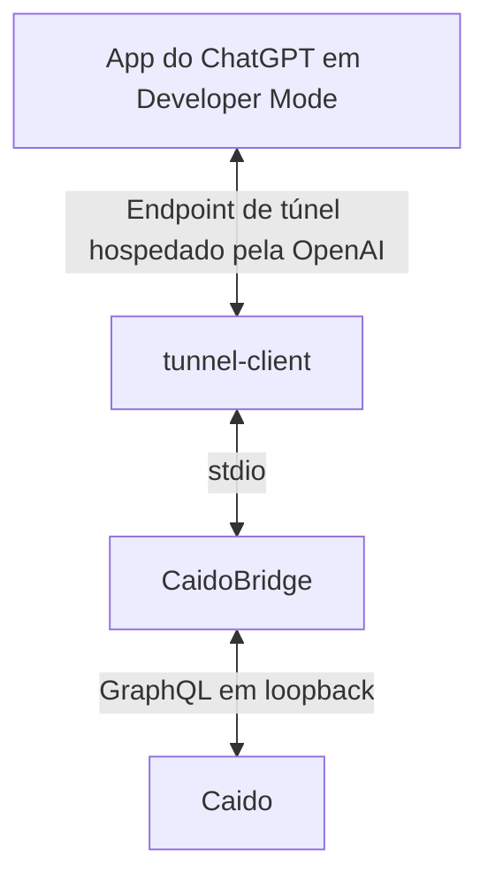

# CaidoBridge

CaidoBridge é um servidor Model Context Protocol (MCP) local que permite ao
ChatGPT consultar tráfego capturado pelo Caido e, somente após um opt-in local
separado, reproduzir requests HTTP estritamente definidos pelo Replay do Caido.

> **Estado:** beta e ferramenta local para desenvolvedores. Trate cada build
> como release candidate até a source tag passar no CI e no checklist Windows.
> Use apenas em sistemas próprios ou com autorização explícita.

Nome do produto e do executável: **CaidoBridge / CaidoBridge.exe**

O diretório `%LOCALAPPDATA%\PHCaidoMCP`, o profile `ph-caido-mcp` e a tarefa
`PH Caido MCP Tunnel` foram preservados apenas como contratos de compatibilidade
para permitir upgrade seguro da v0.3.1. O executável agora é `CaidoBridge.exe`.

## O que ele faz — e o que não faz

CaidoBridge oferece oito tools de observação/preview, conecta-se somente à API
GraphQL local do Caido e usa o OpenAI Secure MCP Tunnel como conexão HTTPS
privada de saída. Duas tools que enviam requests aparecem apenas depois de
habilitar Active Replay localmente.

Ele não é scanner, crawler, fuzzer, brute forcer ou executor em lote; não troca
o projeto selecionado no Caido; não expõe o Caido à internet; não emite verdict
automático de vulnerabilidade; e não transforma o repositório em um plugin
público submetido à loja. A conexão serve a um app em Developer Mode.

**Nenhum plugin do Caido é necessário. O CaidoBridge se comunica com o Caido por sua API local.**

## Arquitetura



O repositório pode ser público enquanto CaidoBridge, Caido e seus dados
continuam locais. O túnel abre uma conexão de saída; não existe entrada pública
para o MCP ou para a API do Caido. Consulte [Arquitetura](architecture.md).

## Requisitos e dependências

- Windows amd64 e Windows PowerShell 5.1 ou superior.
- Caido 0.57.0 ou mais recente. Essa é a baseline conhecida, não uma promessa
  de compatibilidade com qualquer mudança futura da API GraphQL não pública.
- `tunnel-client.exe` oficial da OpenAI.
- Tunnel ID associado à organização e ao workspace corretos, Runtime API Key
  restrita e permissões Tunnels **Read + Use**.
- Developer Mode disponível no workspace do ChatGPT.

| Dependência | Para que serve | Incluída? | Onde obter | Onde instalar |
| --- | --- | ---: | --- | --- |
| Caido | Proxy e API local | Não | [Download oficial](https://www.caido.io/download/) | Instalação normal |
| tunnel-client | Conexão privada com a OpenAI | Não | [Release oficial mais recente](https://github.com/openai/tunnel-client/releases/latest) | `bin\tunnel-client.exe` |
| Tunnel ID | Identidade do túnel | Não | [Platform Tunnels](https://platform.openai.com/settings/organization/tunnels) | Informado ao instalador |
| Runtime API Key | Autenticação do tunnel-client | Não | [Runtime API keys](https://platform.openai.com/settings/organization/api-keys) | Entrada oculta; DPAPI |
| Token do Caido | Autenticação da API local | Não | [GraphQL oficial do Caido](https://docs.caido.io/app/concepts/graphql.html) | Entrada oculta; DPAPI |
| Go | Somente compilação | Não | [go.dev](https://go.dev/dl/) | Desenvolvedores |

O `tunnel-client` possui licença Apache-2.0, mas seu binário não é redistribuído.
Baixe-o somente da OpenAI e confira o checksum oficial.

## Tools MCP

| Tool | Disponibilidade | Efeito |
| --- | --- | --- |
| `caido_get_current_project` | Sempre | Lê o projeto selecionado |
| `caido_list_projects` | Sempre | Lista projetos e marca o selecionado |
| `caido_list_requests` | Sempre | Consulta o HTTP History com HTTPQL/paginação |
| `caido_get_request` | Sempre | Lê uma request/response pelo ID visível |
| `caido_get_sitemap` | Sempre | Lê o Sitemap |
| `caido_list_scopes` | Sempre | Lê os scopes do Caido |
| `caido_is_in_scope` | Sempre | Avalia host/URL contra um `scopeId` exato; allowlist vazia bloqueia tudo |
| `caido_preview_replay` | Sempre | Mostra o preview e gera token de dois minutos/uso único, sem enviar |
| `caido_replay_request` | Active Replay | Envia a request exata vinculada ao token |
| `caido_test_hypothesis` | Active Replay | Executa uma mutação vinculada e diff factual |

As oito primeiras declaram hints read-only, não destrutivos, idempotentes e
closed-world. As duas ativas não são registradas até o opt-in protegido.

Para Replay, escolha um ID exato em `caido_list_scopes` e use o mesmo
`scopeId` no preview e na tool ativa. O `previewToken` expira em dois
minutos, é consumido na primeira tentativa e fica vinculado a projeto, request,
scope e fingerprints da origem e da request preparada. Alterar a mutação ou
reutilizar o token é bloqueado.

## Instalação limpa

Depois que uma GitHub Release for publicada, baixe dela
`CaidoBridge-v0.4.0-windows-amd64.zip` e seu `.sha256`. Um artifact de
workflow isolado não é uma release publicada. O executável não tem assinatura
Authenticode, portanto o SmartScreen pode aparecer. Confira o SHA-256 antes de
desbloquear o ZIP.

### 1. Prepare o Caido

| | Instrução |
| --- | --- |
| Ação | Instale a versão atual, faça login, abra um projeto e mantenha o Caido aberto. |
| Comando | Nenhum; a URL padrão é `http://127.0.0.1:8080`. |
| Esperado | `/health` local informa que o Caido está pronto. |
| Erro comum | Se estiver fechado, em outra porta ou sem projeto, corrija e rode novamente. |

### 2. Obtenha o token local do Caido

Siga a [documentação GraphQL oficial](https://docs.caido.io/app/concepts/graphql.html):
autentique-se na GUI, abra as ferramentas de desenvolvedor com `Ctrl+Shift+I`
e execute no console:

```javascript
JSON.parse(localStorage.CAIDO_AUTHENTICATION).accessToken;
```

Não grave nem passe o token na linha de comando. O instalador usa entrada
oculta. Quando expirar, use o wrapper de atualização.

### 3. Instale o tunnel-client externo

Baixe o ZIP Windows amd64 da
[release oficial mais recente](https://github.com/openai/tunnel-client/releases/latest),
valide seu checksum e coloque o executável em:

```text
CaidoBridge-v0.4.0-windows-amd64\bin\tunnel-client.exe
```

O instalador também procura na raiz, no `PATH`, em um caminho fornecido e em
uma instalação anterior. Se não encontrar, para antes de alterar o sistema e
mostra URL, nome, destino e comando exatos.

### 4. Crie o túnel e a Runtime API Key

Em [Platform tunnel settings](https://platform.openai.com/settings/organization/tunnels),
crie/selecione o túnel e associe o workspace do ChatGPT. Em
[Runtime API keys](https://platform.openai.com/settings/organization/api-keys),
crie uma chave **Restricted** com Tunnels **Read + Use**. Tunnel ID e Runtime
API Key são valores diferentes. Não use Admin API Key no daemon.

### 5. Execute o instalador

Abra o Windows PowerShell na pasta extraída:

```powershell
Unblock-File .\install.ps1
powershell -NoProfile -ExecutionPolicy Bypass -File .\install.ps1
```

Resultado esperado:

```text
CAIDOBRIDGE v0.4.0 INSTALLED
Active Replay: disabled
```

O instalador valida manifest, plataforma, arquitetura, Caido, credentials,
tunnel ID, doctors, profile, tarefa e readiness. Somente depois confirma a
instalação. Falhas posteriores restauram runtime, configuração, profile e
tarefa anteriores. Uma nova execução é idempotente e preserva o opt-in da
v0.3.1. Para outra porta local:

```powershell
.\install.ps1 -CaidoUrl http://127.0.0.1:<PORT>
```

Nenhum secret é aceito como argumento.

### 6. Doctor e status

```powershell
.\doctor.ps1
.\status.ps1
```

O esperado é autenticação e leitura do Caido válidas, tarefa ativa e túnel
ready. Consulte [Troubleshooting](troubleshooting.md) para erros.

### 7. Conecte no ChatGPT

1. Abra **Settings → Security and login** e ative **Developer mode**.
2. Abra [ChatGPT Plugins](https://chatgpt.com/#settings/Connectors).
3. Clique em **+**, informe nome/descrição e escolha **Tunnel** em Connection.
4. Selecione o túnel ou informe o mesmo `tunnel_id`.
5. Revise as oito tools read-only/preview descobertas.
6. Inicie um chat novo, adicione a conexão e faça o primeiro teste somente de
   leitura, por exemplo listar projetos ou mostrar o projeto atual.

A disponibilidade do Developer Mode depende da conta e da política do
workspace. O tunnel-client precisa continuar saudável durante descoberta e
chamadas. Veja o [guia atual da OpenAI](https://developers.openai.com/plugins/deploy/connect-chatgpt).

## Active Replay

Para um alvo autorizado, depois de revisar o modelo de segurança:

```powershell
.\enable-replay.ps1
```

Reconecte ou use Refresh no app para descobrir as duas tools ativas. Ao terminar:

```powershell
.\disable-replay.ps1
```

Cada envio ainda exige projeto atual, ID visível, method/host/path/fingerprint,
um scope exato, token de preview ainda não usado para a mesma request preparada,
Host imutável, confirmação de execução e confirmação adicional para métodos
potencialmente state-changing.

## Token, atualização e desinstalação

Atualize o token do Caido com entrada oculta:

```powershell
.\update-caido-token.ps1
```

Para atualizar o CaidoBridge, baixe/verifique a release nova e execute seu
`install.ps1` com o Caido aberto. DPAPI, profile, Replay, identificadores e
rollback são preservados.

Para desinstalar:

```powershell
.\uninstall.ps1
```

Escolha remover somente autostart; autostart+runtime; ou tudo, inclusive logs,
profile e credentials DPAPI. Escopos destrutivos exigem confirmação.

## Segurança e limitações deliberadas

- URL do Caido limitada a loopback; redirects/origin changes bloqueados; token
  enviado somente para `POST /graphql` no origin exato.
- Secrets em DPAPI do usuário atual, ACL restrita, nunca em tools/logs normais.
- Valores de headers sensíveis são redigidos quando presentes; bodies não são
  redigidos e podem conter dados da aplicação. O output informa esses fatos.
- Project ID, request ID, method, host, path, fingerprint, scope, framing e
  confirmações são checados antes de Replay.
- Não há fuzzing, crawling, brute force, batch, concorrência, negative control
  automático, banco MCP persistente ou verdict de vulnerabilidade.
- Replay pode alterar o alvo e não pode ser desfeito. Autorização e scope são
  responsabilidade do operador.

Leia [Modelo de segurança](security-model.md), [Arquitetura](architecture.md) e
[SECURITY.md](../SECURITY.md).

## Desenvolvimento

```powershell
go mod verify
go test ./...
go vet ./...
$env:CGO_ENABLED = '0'
$env:GOOS = 'windows'
$env:GOARCH = 'amd64'
go build -buildvcs=false -trimpath -ldflags='-s -w' `
  -o .\bin\CaidoBridge.exe .\cmd\caidobridge
.\bin\CaidoBridge.exe version
.\scripts\installer-tests.ps1
.\scripts\verify-repository.ps1
.\scripts\build-release.ps1
```

Versão esperada: `CaidoBridge v0.4.0`. `go test -race ./...` exige CGO e
compilador C compatível. Consulte [CONTRIBUTING.md](../CONTRIBUTING.md),
[LICENSE](../LICENSE) e [THIRD_PARTY_NOTICES.md](../THIRD_PARTY_NOTICES.md).

## Aviso

CaidoBridge é independente e não possui afiliação, endosso ou suporte oficial
do Caido ou da OpenAI. Use somente em ambientes próprios ou expressamente
autorizados.
